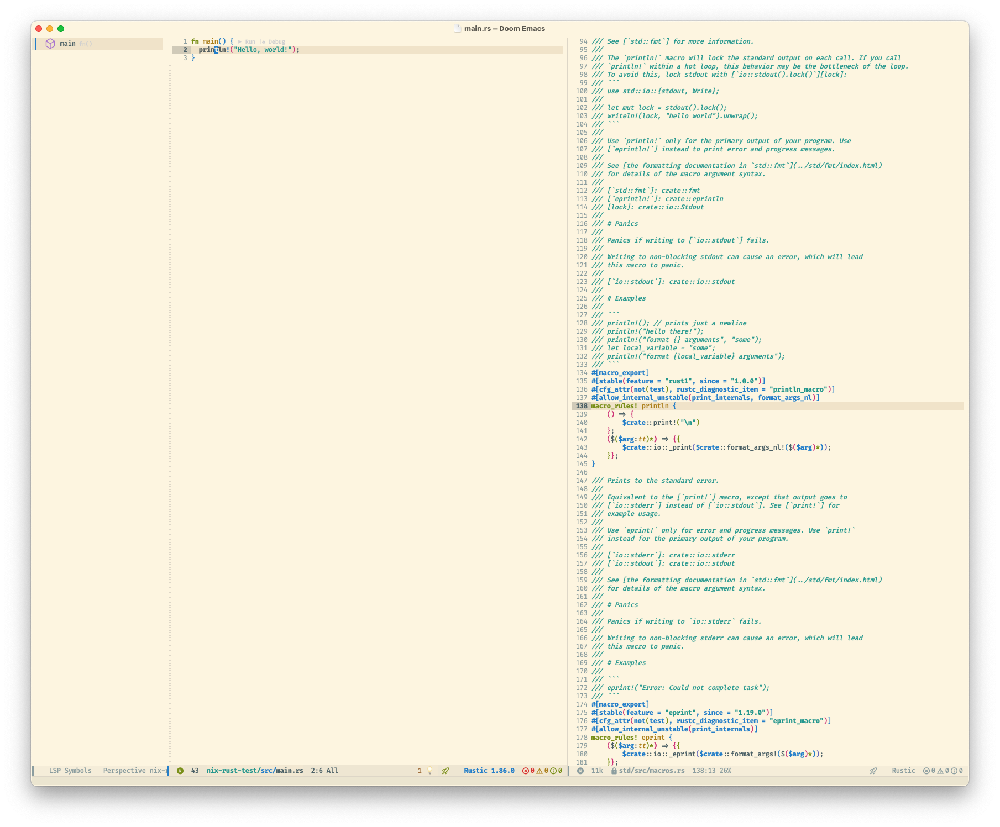
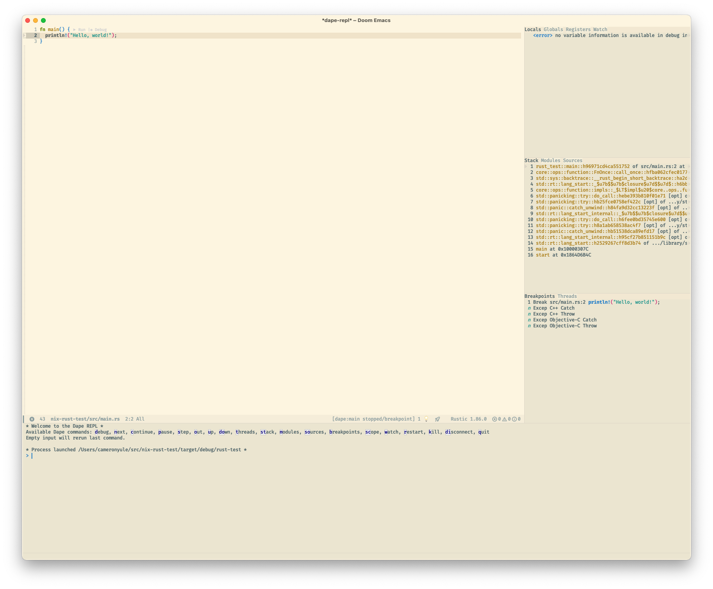

# Nix Rust Test

A simple experiment to understand building Rust projects with Nix.

## Rationale

There are many different ways to use Rust from within Nix ([manual](https://nixos.org/manual/nixpkgs/stable/#rust), [wiki](https://nixos.wiki/wiki/Rust])) such as: installing the `rustc` and `cargo` packages directly from Nixpkgs; installing [`rustup`](https://rust-lang.github.io/rustup/) from Nixpkgs and delegating management of the Rust toolchain to that; or using an [overlay](https://nixos.wiki/wiki/Overlays) such as [rust-overlay](https://github.com/oxalica/rust-overlay) or [Fenix](https://github.com/nix-community/fenix). This example uses Fenix, as this provides the core functionality of `rustup` — namely the ability to specify exact versions of the Rust toolchain — while remaining within the Nix ecosystem.

## Development

We can start a Nix [development shell](https://nix.dev/manual/nix/2.28/command-ref/new-cli/nix3-develop) — which provides the full development environment we've specified with Nix — while also retaining our current shell configuration. This ensures we retain our prompt, aliases, access to programs installed on the host, etc.

### Command Line

``` shell
nix develop --command $SHELL
```

### Editor



Using the [Language Server Protocol](https://microsoft.github.io/language-server-protocol/) (LSP) via the [lsp-mode](https://github.com/emacs-lsp/lsp-mode) client for Emacs on macOS. The LSP server for Rust is [rust-analyzer](https://rust-analyzer.github.io) which is installed for us by Fenix in this example project.

## Debugging

These examples use [LLDB](https://lldb.llvm.org) as I predominantly use macOS.

### Command Line

``` shell
$ lldb target/debug/rust-test
(lldb) target create "target/debug/rust-test"
Current executable set to 'nix-rust-test/target/debug/rust-test' (arm64).
(lldb) process launch
Process 8350 launched: 'nix-rust-test/target/debug/rust-test' (arm64)
Hello, world!
Process 8350 exited with status = 0 (0x00000000)
```

### Editor



Using the [Debug Adapter Protocol](https://microsoft.github.io/debug-adapter-protocol/) (DAP) via the [dape](https://github.com/svaante/dape) client for Emacs on macOS. Note that the LLDB debug server [must be code signed on macOS](https://lldb.llvm.org/resources/build.html#code-signing-on-macos). While you can [build your own self-signed copy](https://github.com/NixOS/nixpkgs/pull/374846#issuecomment-2858114811), the simplest path is to obtain the version of `debugserver` which Apple ships as part of Xcode and [set LLDB_DEBUGSERVER_PATH](https://github.com/NixOS/nixpkgs/issues/252838#issuecomment-2598171564) to that.

## Testing

For testing we may want to try our build in an isolated environment closer to those used by [nix build](https://nix.dev/manual/nix/2.28/command-ref/new-cli/nix3-build). We can achieve this with the `--ignore-environment` option, which unsets all environment variables from the host shell (e.g., $PATH). We can use this in combation with the [`--norc`](https://www.gnu.org/software/bash/manual/html_node/Bash-Startup-Files.html) option of Bash to also skip executing any startup commands specified on the host system (e.g., initialising Nix, invoking a custom prompt, etc).

``` shell
nix develop --ignore-environment --command bash --norc
```

## Build

Once in a development shell, [`rustc`](https://doc.rust-lang.org/rustc/), [`cargo`](https://doc.rust-lang.org/cargo/), and friends will be available along with any other dependencies declared in our flake.

``` shell
cargo build
```
